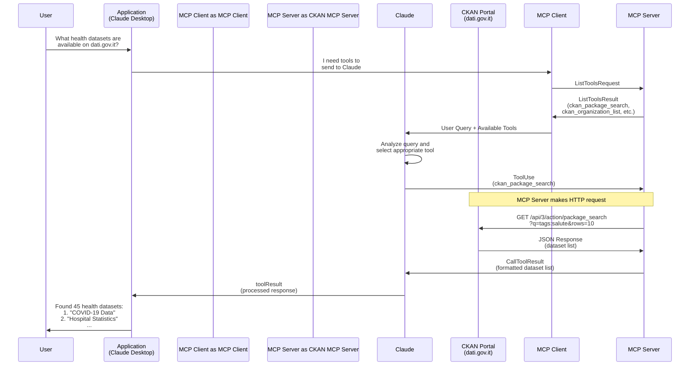

# CKAN MCP Server Architecture Flow

This diagram illustrates how the CKAN MCP Server processes a user query through the Model Context Protocol (MCP) architecture.

## Example Query Flow

The example shows a user asking Claude to search for health datasets on the Italian open data portal dati.gov.it.

## Flow Description

1. **User Query**: User asks a question through their application (e.g., Claude Desktop)

2. **Tool Discovery**:
   - Application requests available tools from MCP Client
   - MCP Client queries CKAN MCP Server for tool list
   - Server responds with available tools (package_search, organization_list, etc.)

3. **Tool Selection**:
   - MCP Client sends user query and available tools to Claude
   - Claude analyzes the query and selects the appropriate tool (`ckan_package_search`)

4. **Tool Execution**:
   - Claude sends ToolUse request with parameters to MCP Server
   - MCP Server translates this to CKAN API call
   - CKAN portal returns dataset results

5. **Response Processing**:
   - MCP Server formats the response (markdown or JSON)
   - Returns CallToolResult to Claude
   - Claude processes and presents the answer to user

## Key Components

- **User**: End user interacting with Claude
- **Application**: Frontend (Claude Desktop, CLI, web interface)
- **MCP Client**: Handles protocol communication
- **CKAN MCP Server**: This project - translates MCP requests to CKAN API calls
- **Claude**: AI assistant that interprets queries and uses tools
- **CKAN Portal**: Open data portal (dati.gov.it, data.gov, etc.)

## Available Tools

The CKAN MCP Server provides these tools:

- `ckan_package_search` - Search datasets with Solr syntax
- `ckan_package_show` - Get dataset details
- `ckan_organization_list` - List organizations
- `ckan_organization_show` - Get organization details
- `ckan_organization_search` - Search organizations
- `ckan_group_list` - List groups
- `ckan_group_show` - Get group details
- `ckan_group_search` - Search groups
- `ckan_datastore_search` - Query tabular data
- `ckan_datastore_search_sql` - SQL queries on DataStore
- `ckan_tag_list` - List available tags
- `ckan_status_show` - Check portal status
- `ckan_find_relevant_datasets` - Relevance-ranked search
- `ckan_get_mqa_quality` - Get dataset quality metrics (dati.gov.it only)
- `ckan_get_mqa_quality_details` - Get dataset quality reasons (dati.gov.it only)

## Transport Modes

The server supports three deployment modes:

- **stdio**: Local integration (Claude Desktop) - default
- **http**: Remote HTTP server (port 3000)
- **Cloudflare Workers**: Global edge deployment

See `DEPLOYMENT.md` for deployment instructions.
