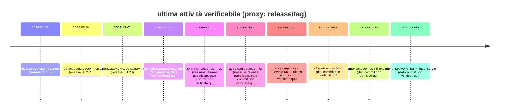

# Deep research sui progetti MCP server più popolari per portali open data

## Sintesi esecutiva

L’acronimo **MCP**, nel contesto contemporaneo dei “MCP server”, è documentato in modo prevalente come **Model Context Protocol**: un protocollo aperto per collegare applicazioni LLM a strumenti e fonti dati esterne (architettura client–host–server, JSON-RPC). citeturn12search0turn12search2turn12search7turn12search6

Per l’obiettivo “interagire con portali open data”, l’ecosistema “MCP server” si concentra soprattutto su tre famiglie:

- **bridge “schema→tools”** (soprattutto **OpenAPI/Swagger → MCP tools**), che scalano bene perché molti portali open data espongono API REST documentate in OpenAPI. (Esempio: server che genera tool automaticamente da una spec OpenAPI). citeturn21view0turn19view0  
- **connettori specializzati per portali** (es. piattaforme nazionali come **data.gouv.fr** o portali CKAN come **data.gov.il**), spesso con tool ad hoc per ricerca, metadati, dataset, risorse e talvolta funzioni “data-friendly” (profilazione, visualizzazione, caching). citeturn39view0turn16view0turn14view0  
- **suite multi-API** (molte fonti governative in un unico server/SDK), con gestione robusta di caching/rate limiting e una grande superficie di strumenti. citeturn38view1turn28view0  

Risultato principale: per **popolarità GitHub (stelle)**, emergono due “giganti” (un server ufficiale per la piattaforma francese e un server per esplorare specifiche OpenAPI), poi un gruppo di progetti rilevanti che coprono l’interoperabilità OpenAPI, portali governativi (USA, Israele, GovInfo) e API open data globali (World Bank), oltre a progetti orientati a dati RDF/SPARQL. citeturn38view0turn19view0turn14view0turn21view0turn10view0turn16view0turn38view1turn20view0turn0search2turn0search3

**Reddit**: nei thread verificabili via endpoint JSON di Reddit, i picchi di engagement (upvote + commenti) riguardano soprattutto (a) l’MCP su open data governativi USA e (b) l’annuncio “Francia / data.gouv”. citeturn28view0turn35view0

**Livello di confidenza (globale): medio-alto** sulla classifica GitHub (stelle e metadati “core” dei repo che ho potuto aprire); **medio** sulle metriche Reddit (campionamento per query mirate e misure ottenute via JSON per alcuni thread, non una scansione esaustiva di tutte le citazioni). citeturn28view0turn35view0turn39view0

## Assunzioni su MCP e interpretazioni alternative

### Assunzione adottata
Dato che “MCP server” è ambiguo, ho adottato l’assunzione esplicita che “MCP server” significhi principalmente **Model Context Protocol server** (server che espongono *tools/resources/prompts* a client LLM). Questo è coerente con la documentazione ufficiale del protocollo e con i repository analizzati. citeturn12search0turn12search6turn12search7turn39view0

### Interpretazioni alternative incontrate
Nei materiali consultati, “MCP” è usato esplicitamente come **Model Context Protocol** (non come “Mobile Content Provider”). Esempio: documentazione “GovInfo MCP server” e repository che descrivono MCP come standard per connettere AI ad altri sistemi. citeturn14view0turn12search0turn12search2

## Metodologia e criteri di popolarità

### Scopo operativo
Selezionare progetti “MCP server” (o progetti che pubblicano/gestiscono un MCP server) orientati a **interazione con portali open data** tramite:
- API e cataloghi governativi (nazionali, federali, istituzionali)
- schemi OpenAPI/Swagger (bridge generalista verso portali open data che espongono OpenAPI)
- CKAN (molti portali open data “classici”)
- RDF/SPARQL e dataset open “knowledge graph style” citeturn21view0turn16view0turn17view0turn0search2  

### Popolarità su entity["company","GitHub","code hosting platform"]
- Ordinamento per **numero di stelle** (snapshot alla data corrente della sessione, 2026-03-08 Europe/Rome). Esempi: valori “Stars” nelle pagine repo. citeturn38view0turn19view0turn14view0turn21view0turn10view0turn16view0turn38view1turn20view0  

### Discussione su entity["company","Reddit","social news platform"]
- “Menzioni/engagement” misurati su thread trovati con query mirate e, quando possibile, letti tramite endpoint JSON (campi `ups` e `num_comments`).
- **Engagement score** (qui): `ups + num_comments` per thread principale.  
Esempi verificati: thread “US Government Open Data MCP” e thread “France has just deployed…”. citeturn28view0turn35view0  

**Nota metodologica critica**: non è una scansione completa di tutti i subreddit/keyword possibili; quindi le metriche Reddit sono “best effort” e vanno viste come **indicatori** più che conteggi definitivi. **Confidenza: media**. citeturn28view0turn35view0  

## Confronto tra i dieci progetti

### Tabella comparativa

Legenda rapida:
- “Menzioni Reddit” = `#thread verificati (engagement score)`; se non ho trovato thread misurabili nel perimetro, indico `0 (0)`.

| progetto | stelle GitHub | menzioni Reddit | linguaggio | integrazioni open data | feature chiave | stato manutenzione |
|---|---:|---:|---|---|---|---|
| datagouv/datagouv-mcp | 935 citeturn38view0 | 1 (91) citeturn35view0 | Python citeturn38view0 | API data.gouv.fr; include tool per spec OpenAPI di “dataservices” citeturn39view0turn18search8 | istanza pubblica, config per molti client, tool catalogo/dataset/dataservices citeturn39view0turn38view0turn18search8 | active (release recente) citeturn38view0 |
| janwilmake/openapi-mcp-server | 883 citeturn19view0 | 0 (0) | TypeScript citeturn19view0 | OpenAPI via oapis.org (bridge verso API/portali OpenAPI) citeturn19view0 | ricerca+riassunto spec, endpoint MCP remoto, Cloudflare Workers citeturn19view0 | active (segnali indiretti, conf. media) citeturn19view0 |
| usgpo/api (GovInfo MCP docs) | 237 citeturn14view0 | 0 (0) | n/d (repo docs+API) citeturn14view0 | GovInfo MCP server (endpoint remoto) citeturn14view0 | tool `searchGovInfo`, `describePackageOrGranule`, API key citeturn14view0 | active (public preview 2026) citeturn14view0turn8search9 |
| ckanthony/openapi-mcp | 175 citeturn21view0 | 0 (0) | Go citeturn21view0 | OpenAPI v2/v3 → tool MCP; utile per portali con swagger/openapi citeturn21view0 | generazione tool, filtri endpoint/tag, gestione chiavi senza esporle citeturn21view0 | active (segnali indiretti, conf. media) citeturn21view0 |
| OpenDataMCP/OpenDataMCP | 145 citeturn10view0 | 0 (0) | Python citeturn10view0 | framework “provider” per fonti open data; CLI setup citeturn10view0 | CLI `odmcp`, template provider, publishing/distribution citeturn10view0 | dormant (ultima release 2024-12-02) citeturn10view0 |
| aviveldan/datagov-mcp | 139 citeturn16view0 | 0 (0) | Python citeturn16view0 | CKAN (data.gov.il): search, org, datastore, ecc. citeturn16view0 | async, “full CKAN coverage”, profiling dataset, chart/map citeturn16view0 | active (repo con changelog+test, conf. media) citeturn16view0 |
| sib-swiss/sparql-llm | 96 citeturn0search2 | 0 (0) | (non verificato qui) | SPARQL/RDF (endpoint open) citeturn0search2 | LLM↔SPARQL (orientato a query su endpoint) citeturn0search2 | n/d (dati incompleti) |
| lzinga/us-gov-open-data-mcp | 66 citeturn38view1 | 1 (188) citeturn28view0 | TypeScript citeturn38view1 | 40+ API gov/intl (incl. World Bank) citeturn38view1 | 250+ tool, SDK TS, caching/retry/rate limiting citeturn38view1turn28view0 | active (release 2026-03-06) citeturn38view1 |
| emekaokoye/mcp-rdf-explorer | 49 citeturn0search3 | 0 (0) | (non verificato qui) | RDF graph / SPARQL citeturn0search3 | esplorazione RDF (orientato a dati open “graph”) citeturn0search3 | n/d (dati incompleti) |
| anshumax/world_bank_mcp_server | 45 citeturn20view0 | 0 (0) | Python citeturn20view0 | World Bank Open Data API citeturn20view0 | lista paesi/indicatori + analisi indicatori citeturn20view0 | active (segnali indiretti, conf. media) citeturn20view0 |

**Nota sulla deduplica GitHub/Reddit**: i progetti con evidenza Reddit misurata (datagouv-mcp, us-gov-open-data-mcp) sono già presenti nella top 10 per stelle, quindi la fusione non cambia il set finale. citeturn28view0turn35view0turn38view0turn38view1  

### Schede sintetiche dei progetti selezionati

Di seguito, per ciascun progetto: URL repo, metadati, stack, integrazione open data, feature, estendibilità, casi d’uso, punti di forza/limiti, link a doc/changelog.  
Dove non ho potuto verificare un campo in modo affidabile dai materiali aperti in questa sessione, lo marco come “non verificato”.

**datagouv/datagouv-mcp** citeturn38view0turn39view0  
- Repo: `https://github.com/datagouv/datagouv-mcp` citeturn38view0  
- Stelle: 935 citeturn38view0  
- Linguaggio: Python (prevalente) citeturn38view0  
- Licenza: MIT citeturn38view0  
- Ultimo commit: **proxy** = ultima release `v0.2.20` (2026-03-04). citeturn38view0  
- Architettura/stack: server MCP con trasporto HTTP/Streamable (indicazioni di configurazione per molti client), esecuzione locale via `uv run main.py`, configurazione ambiente `.env`. citeturn38view0turn39view0  
- Integrazione open data: API della piattaforma **data.gouv.fr** (catalogo/dataset), più tool che recuperano e riassumono specifiche OpenAPI dei “dataservices” catalogati. citeturn38view0turn18search8  
- Feature principali: istanza pubblica pronta (`https://mcp.data.gouv.fr/mcp`), guide di setup per molti client (incluso flusso con ChatGPT “connectors”), e tool dedicati alle entità del catalogo (dataset/organizzazioni/dataservices). citeturn39view0turn38view0turn18search8  
- Plugin/estensioni: non dichiarate come “plugin”; estendibilità via sviluppo interno del server e toolset (repo contiene cartelle `tools/`). citeturn39view0  
- Casi d’uso: ricerca dataset (“trova dataset su prezzi immobili”), esplorazione metadati, recupero OpenAPI della base API di un dataservice per poi costruire chiamate strutturate. citeturn39view0turn18search8  
- Punti di forza: **istanza pubblica** e “ricette” client-by-client (riduce attrito), plus tool orientati a *dataservices* che accorciano la strada fra “catalogo” e “API operativa”. citeturn39view0turn18search8  
- Limitazioni: la “data ultimo commit” non è ricavata direttamente qui (uso la release come proxy); qualità dipende dalle API e dai metadati del catalogo sottostante. citeturn38view0turn39view0  
- Doc/changelog: `https://github.com/datagouv/datagouv-mcp/blob/main/README.md` e `https://github.com/datagouv/datagouv-mcp/blob/main/CHANGELOG.md` citeturn39view0turn38view0  

**janwilmake/openapi-mcp-server** citeturn19view0  
- Repo: `https://github.com/janwilmake/openapi-mcp-server` citeturn19view0  
- Stelle: 883 citeturn19view0  
- Linguaggio: TypeScript citeturn19view0  
- Licenza: MIT citeturn19view0  
- Ultimo commit: non verificato direttamente (nessuna release mostrata; repo con tag). citeturn19view0  
- Architettura/stack: server MCP che “cerca ed esplora” specifiche OpenAPI tramite **oapis.org**; implementazione con `wrangler dev` e file `worker.ts` (indicativo di deploy su Cloudflare Workers). citeturn19view0  
- Integrazione open data: indiretta ma potente: se un portale open data ha una spec OpenAPI indicizzabile, il server rende l’API esplorabile in modo “LLM-friendly”, riducendo il costo di “capire l’API” prima di usarla. citeturn19view0  
- Feature principali: processo in 3 passi (identificare spec → riassumerla in linguaggio semplice → dettagliare operazioni/endpoints), supporto JSON/YAML, endpoint remoto MCP `https://openapi-mcp.openapisearch.com/mcp`. citeturn19view0  
- Plugin/estensioni: non dichiarati; estensione “di fatto” tramite copertura crescente di spec OpenAPI disponibili via oapis.org. citeturn19view0  
- Casi d’uso: “dammi una panoramica dell’API del portale X”, “mostrami come chiamare l’endpoint Y”, utile quando la spec è troppo grande per stare in contesto. citeturn19view0  
- Punti di forza: scala bene (non per singolo portale ma per ecosistema OpenAPI), riduce lavoro manuale su documentazione. citeturn19view0  
- Limitazioni: dipende dall’esistenza/qualità delle spec OpenAPI; non è un connettore “semantico” specifico per cataloghi (CKAN/Socrata) ma un abilitatore generalista. citeturn19view0  
- Doc: `https://github.com/janwilmake/openapi-mcp-server/blob/main/README.md` citeturn19view0  

**usgpo/api (GovInfo MCP server – public preview)** citeturn14view0turn8search9  
- Repo: `https://github.com/usgpo/api` citeturn14view0  
- Stelle: 237 citeturn14view0  
- Linguaggio: n/d (repo API+docs; il server è endpoint remoto documentato) citeturn14view0  
- Licenza: presente nel repo (non dettagliata qui); pagina indica repo con sezione License. citeturn14view0  
- Ultimo commit: non verificato direttamente (qui catturata la pagina `docs/mcp.md`). citeturn14view0  
- Architettura/stack: MCP server **remoto** (public preview) raggiungibile via URL, autenticazione via header `x-api-key`. citeturn14view0  
- Integrazione open data: accesso a contenuti e metadati GovInfo tramite tool MCP; tool dichiarati: `searchGovInfo` e `describePackageOrGranule`. citeturn14view0  
- Feature principali: risposta “stabile” a parità di parametri; supporto a renditions (HTML/PDF/XML/ZIP) e metadati (MODS/PREMIS) nella descrizione dei pacchetti. citeturn14view0  
- Plugin/estensioni: non dichiarate (server governativo in preview). citeturn14view0  
- Casi d’uso: recupero documenti ufficiali, metadata-driven retrieval, verifiche su pubblicazioni, accesso a renditions per analisi downstream. citeturn14view0  
- Limitazioni: richiede API key; come per ogni MCP, i risultati vanno interpretati dal modello (nota di cautela nel documento). citeturn14view0  
- Doc: `https://github.com/usgpo/api/blob/main/docs/mcp.md` citeturn14view0  

**ckanthony/openapi-mcp** citeturn21view0  
- Repo: `https://github.com/ckanthony/openapi-mcp` citeturn21view0  
- Stelle: 175 citeturn21view0  
- Linguaggio: Go citeturn21view0  
- Licenza: non evidenziata nel frammento (non verificata qui). citeturn21view0  
- Ultimo commit: non verificato direttamente. citeturn21view0  
- Architettura/stack: container Docker che legge una spec `swagger.json`/`openapi.yaml` e genera un toolset MCP; esecuzione su `http://localhost:8080` di default. citeturn21view0  
- Integrazione open data: ponte generalista per qualunque portale open data con OpenAPI/Swagger (anche quando l’API richiede chiavi). citeturn21view0  
- Feature principali: supporto OpenAPI v2/v3, generazione schema tool, **iniezione sicura API key** (header/query/path/cookie) senza esporre chiavi al client MCP; filtri include/exclude su tag/operation; possibilità di spec locale o remota. citeturn21view0  
- Estensioni: non “plugin” formali; la superficie strumenti si estende cambiando spec + filtri. citeturn21view0  
- Casi d’uso: “portare” un portale open data con OpenAPI dentro un client MCP in poche righe; utile anche per API pubbliche con rate limit o auth. citeturn21view0  
- Limitazioni: qualità del toolset dipende dalla qualità della spec; non costruisce semantica di dominio oltre ciò che la spec descrive. citeturn21view0  
- Doc: `https://github.com/ckanthony/openapi-mcp/blob/main/README.md` citeturn21view0  

**OpenDataMCP/OpenDataMCP** citeturn10view0  
- Repo: `https://github.com/OpenDataMCP/OpenDataMCP` citeturn10view0  
- Stelle: 145 citeturn10view0  
- Linguaggio: Python citeturn10view0  
- Licenza: MIT citeturn10view0  
- Ultimo commit: non verificato direttamente; “proxy” = ultima release `0.1.28` (2024-12-02). citeturn10view0  
- Architettura/stack: CLI `odmcp` (es. `uvx odmcp list/info/setup/remove`) e architettura a “provider” in `src/odmcp/providers/` con template e modelli (Pydantic) per tool/resources. citeturn10view0  
- Integrazione open data: dipende dai provider implementati; obiettivo dichiarato: collegare dataset pubblici a client LLM in minuti e offrire un percorso di publishing/distribuzione. citeturn10view0  
- Feature principali: setup in 2 click (focus su client Claude), linee guida per differenziare tool vs resource, template per contribuire nuovi provider. citeturn10view0  
- Punti di forza: “impalcatura” (scaffold) per crescere a catalogo di provider; utile se vuoi standardizzare molti connettori. citeturn10view0  
- Limitazioni: ultimo rilascio nel 2024 (potenziale rallentamento); ecosistema provider dichiarato “early”. citeturn10view0  
- Doc: `https://github.com/OpenDataMCP/OpenDataMCP/blob/main/README.md` + releases `https://github.com/OpenDataMCP/OpenDataMCP/releases` citeturn10view0  

**aviveldan/datagov-mcp (Israele, CKAN)** citeturn16view0  
- Repo: `https://github.com/aviveldan/datagov-mcp` citeturn16view0  
- Stelle: 139 citeturn16view0  
- Linguaggio: Python citeturn16view0  
- Licenza: MIT citeturn16view0  
- Ultimo commit: non verificato direttamente (repo con 66 commit, changelog incluso). citeturn16view0  
- Architettura/stack: server costruito su FastMCP, I/O asincrono con httpx; include test automatizzati e strumenti di visualizzazione (Vega-Lite, Leaflet). citeturn16view0  
- Integrazione open data: **copertura CKAN** (search datasets, org, resources) + DataStore query su `resource_id`; tool convenience `fetch_data`, tool `dataset_profile` per profiling. citeturn16view0  
- Feature principali: profiling (tipi campi, missing, statistiche), generazione grafici e mappe, tool “core CKAN” numerosi (es. `package_search`, `datastore_search`). citeturn16view0  
- Estensioni: estendibile aggiungendo tool (server.py) e seguendo pattern test; più “app” che “framework”. citeturn16view0  
- Casi d’uso: esplorare dataset israeliani, analizzare rapidamente risorse tabellari, produrre visualizzazioni pronte per spiegazioni/brief. citeturn16view0  
- Limitazioni: focalizzato su un portale CKAN specifico (riusabile su altri CKAN solo adattando base URL e dettagli). citeturn16view0  
- Doc/changelog: `https://github.com/aviveldan/datagov-mcp/blob/main/README.md` e `https://github.com/aviveldan/datagov-mcp/blob/main/CHANGELOG.md` citeturn16view0  

**lzinga/us-gov-open-data-mcp** citeturn38view1turn28view0  
- Repo: `https://github.com/lzinga/us-gov-open-data-mcp` citeturn38view1  
- Stelle: 66 citeturn38view1  
- Linguaggio: TypeScript citeturn38view1  
- Licenza: MIT citeturn38view1  
- Ultimo commit: **proxy** = release `v1.1.0` (2026-03-06). citeturn38view1  
- Architettura/stack: MCP server installabile via `npx us-gov-open-data-mcp`; in parallelo SDK TypeScript usabile senza server MCP; funzioni con caching/retry/rate limiting. citeturn38view1  
- Integrazione open data: 40+ API governative e internazionali (liste per categoria: economia, legislativo, salute, ambiente… include “World Bank”). citeturn38view1  
- Feature principali: “250+ tools”, guida dati sorgente, architettura modulare (“aggiungere moduli”), docs generate. citeturn38view1  
- Plugin/estensioni: estensione per moduli (“Add a new API — just create a folder”). citeturn38view1  
- Esempi concreti (file): thread Reddit rimanda a `src/instructions.ts` e `src/prompts.ts` come layer di routing e prompt predefiniti. citeturn28view0turn37search1  
- Casi d’uso: verificare numeri e indicatori pubblici (economia, sanità, lobbying, brevetti), cross-reference tra fonti. citeturn28view0turn38view1  
- Limitazioni: superficie molto ampia → qualche endpoint può essere incoerente o cambiare; il README include disclaimer su schemi complessi/inconsistenti. citeturn38view1turn37search1  
- Doc: `https://lzinga.github.io/us-gov-open-data-mcp/` + repo README `https://github.com/lzinga/us-gov-open-data-mcp/blob/main/README.md` citeturn38view1turn28view0  

**anshumax/world_bank_mcp_server** citeturn20view0  
- Repo: `https://github.com/anshumax/world_bank_mcp_server` citeturn20view0  
- Stelle: 45 citeturn20view0  
- Linguaggio: Python citeturn20view0  
- Licenza: non esplicitata nel frammento (non verificata qui). citeturn20view0  
- Ultimo commit: non verificato direttamente. citeturn20view0  
- Integrazione open data: API open data della entity["organization","World Bank","international financial institution"]. citeturn20view0  
- Feature principali: tool per elencare paesi e indicatori, e per analizzare indicatori (popolazione, povertà, ecc.). citeturn20view0  
- Estensioni: tipicamente estendibile aggiungendo nuovi tool su endpoint World Bank (repo include `src/world_bank_mcp_server`). citeturn20view0  
- Doc: `https://github.com/anshumax/world_bank_mcp_server/blob/master/README.md` citeturn20view0  

**sib-swiss/sparql-llm** citeturn0search2  
- Repo: `https://github.com/sib-swiss/sparql-llm` citeturn0search2  
- Stelle: 96 citeturn0search2  
- Campi non verificati in questa sessione: ultimo commit, licenza, linguaggio principale. citeturn0search2  
- Integrazione open data (alto livello): orientato a interrogare o facilitare interrogazioni su endpoint SPARQL (pattern tipico: knowledge graph/open data “RDF”). citeturn0search2  

**emekaokoye/mcp-rdf-explorer** citeturn0search3  
- Repo: `https://github.com/emekaokoye/mcp-rdf-explorer` citeturn0search3  
- Stelle: 49 citeturn0search3  
- Campi non verificati in questa sessione: ultimo commit, licenza, linguaggio principale. citeturn0search3  
- Integrazione open data (alto livello): esplorazione di grafi RDF (spesso in combinazione con SPARQL). citeturn0search3  

## Feature più interessanti osservate

Qui elenco **10 feature trasversali** (con esempi concreti di file/endpoint/comandi) e perché contano per l’uso con portali open data.

### Generazione automatica di tool da OpenAPI/Swagger
Esempio: `ckanthony/openapi-mcp` legge `swagger.json`/`openapi.yaml` e genera schemi tool; include filtri `--include-tag/--exclude-tag/--include-op/--exclude-op`. citeturn21view0  
Perché conta: per molti portali open data moderni, la documentazione OpenAPI è già l’“unica fonte di verità”; questa feature riduce drasticamente lavoro manuale.

### Gestione sicura delle API key senza esporle al client MCP
Esempio: iniezione di chiavi in header/query/path/cookie e caricamento da env / `.env` in `ckanthony/openapi-mcp`. citeturn21view0  
Perché conta: molti portali open data hanno rate limit o chiavi gratuite; evitare leakage nel prompt è fondamentale.

### “Spec discovery” e riassunto in linguaggio semplice per spec enormi
Esempio: `janwilmake/openapi-mcp-server` fa un processo in 3 step (identificazione spec → summary → dettaglio operazioni), e offre un endpoint MCP remoto. citeturn19view0  
Perché conta: la documentazione di portali grandi può essere troppo ampia per stare in contesto; il riassunto guidato è una scorciatoia pratica.

### Istanza pubblica pronta all’uso per un portale nazionale
Esempio: `datagouv/datagouv-mcp` espone un’istanza pubblica `https://mcp.data.gouv.fr/mcp` e fornisce config per numerosi client (Claude, Cursor, ChatGPT connectors, ecc.). citeturn39view0turn38view0  
Perché conta: abbassa il “time-to-first-query” da ore a minuti.

### Tool che collegano “catalogo” e “API operativa” tramite OpenAPI di dataservice
Esempio: tool `get_dataservice_openapi_spec` (riassume la spec OpenAPI/Swagger di un dataservice) nel progetto data.gouv. citeturn18search8turn38view0  
Perché conta: spesso l’open data non è solo “file”, ma anche API tematiche; questo collega metadati e chiamate reali.

### Suite multi-API con caching/retry/rate limiting integrati
Esempio: `lzinga/us-gov-open-data-mcp` dichiara che tutte le funzioni (anche via SDK) includono caching, retry e rate limiting. citeturn38view1  
Perché conta: su open data reali, rate limit e instabilità non sono un’eccezione; senza queste “cinture di sicurezza” l’agente fallisce spesso.

### Layer di “instruction routing” e prompt predefiniti per guidare la selezione delle fonti
Esempi: riferimenti a `src/instructions.ts` e `src/prompts.ts` nel thread su `us-gov-open-data-mcp`. citeturn28view0turn37search1  
Perché conta: quando un server espone centinaia di tool, la difficoltà diventa “quale chiamare”; routing e prompt riducono l’attrito.

### Copertura completa CKAN + DataStore + strumenti “data-friendly”
Esempio: `aviveldan/datagov-mcp` elenca tool CKAN core (`package_search`, `datastore_search`, ecc.) e aggiunge `dataset_profile` per qualità/struttura. citeturn16view0  
Perché conta: CKAN è molto diffuso nei portali open data; DataStore è il punto chiave per analisi tabellare.

### Visualizzazioni integrate (chart/map) come output “pronto da condividere”
Esempio: `aviveldan/datagov-mcp` cita grafici e mappe (Vega-Lite e Leaflet) e tool dedicati alla visualizzazione. citeturn16view0  
Perché conta: su open data, spesso il valore è “spiegare” velocemente; output visivo riduce distanza fra query e insight.

### Tool verticali su grande API open data globale (World Bank)
Esempio: `anshumax/world_bank_mcp_server` espone tool per elencare paesi/indicatori e fare analisi di indicatori. citeturn20view0  
Perché conta: porta dataset globali (economia/sviluppo) in un’interfaccia uniforme MCP, utile per analisi comparate.

## Visualizzazioni e pattern architetturali

### Timeline (Mermaid) delle ultime attività note
La richiesta era “timeline degli ultimi commit”. In questa sessione, per alcuni progetti ho una data affidabile di **release** (usata come *proxy* di attività recente). Dove non c’è release o commit data verificabile nel materiale aperto, segno “sconosciuta”. **Confidenza: media**. citeturn38view0turn38view1turn10view0turn39view0



### Flowchart (Mermaid) dei pattern comuni di integrazione open data

```mermaid
flowchart TD
  A[utente] --> B[host LLM / IDE]
  B --> C[MCP client]
  C --> D[MCP server]

  subgraph "pattern 1: connettore portal-specific"
    D --> E1[adapter API portale\n(es. data.gouv, GovInfo)]
    E1 --> F1[API/portale open data]
    D --> G1[caching + rate limiting]
  end

  subgraph "pattern 2: bridge OpenAPI -> tools"
    D --> E2[parser OpenAPI/Swagger]
    E2 --> H2[tool schema generator]
    H2 --> F2[API REST del portale]
  end

  subgraph "pattern 3: CKAN / cataloghi classici"
    D --> E3[CKAN API client\n(package_search, datastore_search)]
    E3 --> F3[istanza CKAN]
  end

  subgraph "pattern 4: knowledge graph"
    D --> E4[SPARQL client]
    E4 --> F4[SPARQL endpoint]
  end
```

Perché questi pattern contano:
- Open data “reale” è spesso una combinazione di **catalogo + risorse (file) + API**: i connettori efficaci o (a) offrono tool “di dominio” oppure (b) industrializzano lo strato di schema (OpenAPI/CKAN/metadata). citeturn39view0turn21view0turn16view0turn12search7  
- MCP supporta trasporti standard (stdio e HTTP/streamable), quindi i progetti si posizionano su “server locale” o “server remoto pubblico” a seconda del target. citeturn12search29turn12search1turn39view0